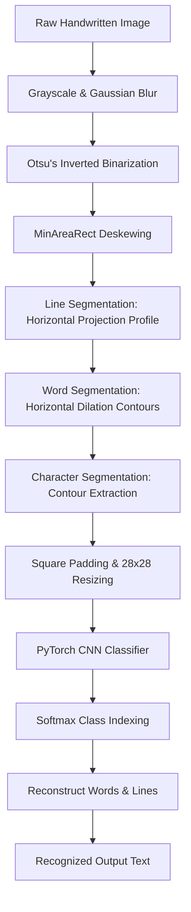

# Handwriting Recognition & OCR System using Deep Learning

A production-quality, learning-focused Handwriting Recognition and OCR (Optical Character Recognition) system built from scratch using **PyTorch** and **OpenCV**. 

This system does not rely on pre-trained engines (like Tesseract or PaddleOCR). Instead, it implements a custom Convolutional Neural Network (CNN) trained on the **EMNIST Balanced** dataset (47 classes representing digits and letters) and integrates a computer vision segmentation pipeline to parse complete pages of handwritten text.

---

## 🚀 Key Features

*   **Custom CNN Classifier**: Built from scratch using PyTorch with dynamic channel expansion, ReLU activations, Dropout regularization, and MaxPooling downsampling.
*   **Computer Vision Preprocessing**: Utilizes OpenCV for grayscale conversion, Gaussian blur noise filtering, Otsu's binarization, and automated tilt-angle correction (deskewing).
*   **Hierarchical Segmentation**: Segments paragraphs of text into lines (horizontal projection profiling), words (horizontal dilation contours), and characters (contour bounding boxes).
*   **Normalization & Centering**: Pads segmented characters to a square canvas preserving aspect ratio before resizing to $28 \times 28$ to prevent shape distortion.
*   **FastAPI REST Backend**: Production-ready API that loads and caches the CNN weights once during startup via lifespan contexts and handles image uploads.
*   **Streamlit Web Interface**: Premium glassmorphic dashboard showcasing step-by-step pipeline visualizations (raw image, preprocessed mask, and bounding box overlays).
*   **Robust Test Suite**: 100% test coverage for all modules using `pytest`.

---

## 📐 System Architecture

The workflow details the journey from a raw handwritten document to clean reconstructed text:



---

## 📂 Folder Structure

```text
Handwritten-OCR/
├── api/
│   └── app.py                # FastAPI REST API (Lifespan loading, image validation)
├── data/
│   └── output/               # Verification samples & visualization outputs
├── models/
│   └── ocr_model.pth         # Saved weights for best validation accuracy
├── src/
│   ├── dataset.py            # EMNIST Balanced loader, transforms, and transpositions
│   ├── model.py              # Custom CNN architecture (nn.Module)
│   ├── preprocessing.py      # OpenCV binarization, blur, and deskewing
│   ├── segmentation.py       # Hierarchical lines/words/chars partition & padding
│   ├── inference.py          # Character prediction, Softmax scores & comments
│   └── ocr_pipeline.py       # Reconstruct full page documents using preloaded CNN
├── tests/
│   ├── test_placeholder.py   # Starter test placeholder
│   ├── test_preprocessing_segmentation.py  # Visual pipeline verification
│   └── test_ocr_system.py    # Pytest suite verifying all modules
├── requirements.txt          # Python dependency specifications
└── README.md                 # Project documentation
```

---

## 🛠️ Installation & Setup

1.  **Clone the Repository**:
    ```bash
    git clone https://github.com/Sarthak1ad/Handwriting-Recognition-OCR-System.git
    cd Handwriting-Recognition-OCR-System
    ```

2.  **Create a Virtual Environment**:
    ```bash
    python -m venv venv
    # On Windows:
    venv\Scripts\activate
    # On macOS/Linux:
    source venv/bin/activate
    ```

3.  **Install Dependencies**:
    ```bash
    pip install -r requirements.txt
    ```

---

## 💻 How to Run

### 1. Model Training
Train the CNN model on the EMNIST Balanced dataset (will automatically download the dataset to the `data/` folder on first run):
```bash
python src/train.py
```
*Weights are saved at `models/ocr_model.pth` when validation accuracy improves.*

### 2. OCR Pipeline Inference
Test the complete OCR pipeline on a local image:
```bash
python src/ocr_pipeline.py
```
*This generates a bounding box visual output at `data/output/ocr_visualization.png`.*

### 3. FastAPI Server Deployment
Start the backend server on `http://localhost:8000`:
```bash
uvicorn api.app:app --reload
```
*Access interactive Swagger docs at `http://localhost:8000/docs`.*

### 4. Streamlit Web App
Launch the interactive web dashboard:
```bash
streamlit run web/streamlit_app.py
```

---

## 🧪 Running Automated Tests

Run the full pytest suite to verify module mechanics:
```bash
python -m pytest tests/test_ocr_system.py
```

---

## 📈 Suggestion for Future Improvements

To improve classification accuracy beyond EMNIST baseline thresholds (e.g. targeting 95%+):
1.  **Model Enhancements**: Migrate to ResNet18/34 architectures or incorporate Batch Normalization after Conv2d layers.
2.  **Data Augmentation**: Apply random affine transforms, elastic deformations, or shearing during training.
3.  **Sequence Modeling**: Implement a CRNN (Convolutional Recurrent Neural Network) + CTC (Connectionist Temporal Classification) Loss to recognize entire word strings without character-level segmentation.
4.  **Runtime Optimization**: Export the PyTorch model to ONNX runtime format for faster server-side inference.

---

