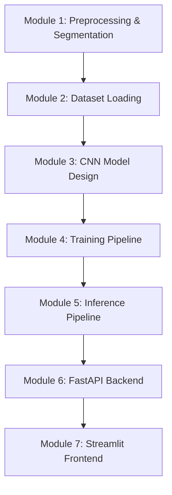

# Handwriting Recognition & OCR System using Deep Learning

This project implements a complete, production-quality Handwriting Recognition and OCR pipeline from scratch using PyTorch and OpenCV. 

## Roadmap & Module Breakdown

To maintain code clarity and build a deep understanding of the system, we will build this project module-by-module. Each module will be independently runnable and testable.

---

## Module 1: Preprocessing & Segmentation (Current Step)

The goal of this module is to take a raw input image of handwritten text (e.g., a sentence or paragraph) and extract individual characters for inference. We will write an OpenCV pipeline to preprocess the image and segment it hierarchically: **Lines -> Words -> Characters**.

### Proposed Changes

We will modify two key files in the `src/` directory:

#### [MODIFY] [preprocessing.py](file:///c:/Users/sarth/OneDrive/Documents/Handwritten-OCR/src/preprocessing.py)
This module handles basic image adjustments using OpenCV:
- Grayscale conversion.
- Noise reduction using Gaussian Blur.
- Adaptive Binarization (Otsu's thresholding / adaptive thresholding) to create a clean black-and-white mask.
- Deskewing (rotation correction) using Radon transform or minAreaRect bounding box orientation.
- Inversion (ensuring characters are white/255 and background is black/0 to match EMNIST format).

#### [MODIFY] [segmentation.py](file:///c:/Users/sarth/OneDrive/Documents/Handwritten-OCR/src/segmentation.py)
This module segments the preprocessed image into smaller regions of interest (ROIs):
- Line Segmentation: Horizontal projection profile analysis to identify gaps between lines of text.
- Word Segmentation: Vertical projection profile analysis within each line or contour dilation to find word clusters.
- Character Segmentation: Vertical projection profile or contour detection to isolate individual characters.
- Padding & Resizing: Padding each character box to preserve aspect ratio, followed by resizing to 28x28 pixels to fit the EMNIST model input format.

---

## User Review Required

> [!IMPORTANT]
> - We will use the **EMNIST Balanced** split (47 classes: 0-9, A-Z, plus lowercase letters that look distinct from uppercase, e.g., a, b, d, e, f, g, h, n, q, r, t). If you prefer another split (like **EMNIST ByClass** with 62 classes), please let me know.
> - The segmentation pipeline assumes structured handwriting with clear gaps between lines/words. Overlapping handwriting or connected cursive will require advanced segmentation or sequence modeling (e.g., CRNN + CTC loss). We will start with a robust contour and projection profile-based segmentation.

---

## Verification Plan

### Automated/Unit Testing
- We will create a test script in the `tests/` directory: [test_preprocessing_segmentation.py](file:///c:/Users/sarth/OneDrive/Documents/Handwritten-OCR/tests/test_preprocessing_segmentation.py).
- We will provide sample handwritten images (generated programmatically or loaded) to test the preprocessing and segmentation.
- Check if output shapes of segmented characters are exactly `(28, 28)`.

### Manual Verification
- A utility script will save intermediate images (preprocessed, lines detected, words detected, character boxes) in a `data/output` directory for visual inspection.
